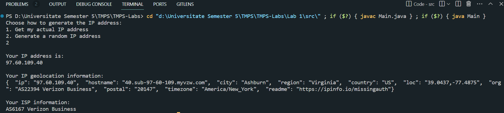

# SOLID Principles

## Author: Zlatovcen Bogdan

---

## Objectives:

- Study and understand the SOLID Principles.

- Choose a domain, define its main classes/models/entities and choose the appropriate instantiation mechanisms.

- Create a sample project that respects SOLID Principles.

## Used SOLID Principles:

- Single Responsibility Principle: In this project, I used this principle by giving only one responsibility to each class. For example, the class "DisplayInformation" is responsible for only displaying printing information to the user. Other classes are used only to generate the IP Address, and the class `IpinfoApi` is used to generate details abput a given IP Address.

- Open-Closed Principle: In this project, I used this principle by creating classes where we can add new methods without modifying the existing ones.

- Liskov Substitution Principle: To follow this rule, the main idea is to add new methods to child classes without modifying the inherited implementation in the parent class. Thus, the child classes `IpinfoApi` and `Ipify` dont modify the implementation of the get request of the parent class `Api`. Thus, we can theorethically substitute the parent class with any of these child classes.

- Interface Segregation Principle: In this project, I used this principle by segregating the interfaces, and thus `IpinfoApi` implements `ApiInterface` and `IpInfoInterface`, `Ipify` implements `ApiInterface` and `IpAddressGenerator`, `IpAddressGeneratorConstructor` implements `IpAddressGenerator`, and `IpAddressRandomGenerator` implements `IpAddressGenerator`.

- Dependency Inversion Principle: The key idea is the higher level modules should not depend on the lower level modules, but they should depend on abstractions. In this project, I used this principle by making the class `DisplayInformation` depend on the interface `IpAddressGenerator` and not on the classes that implement this interface. Thus, we can change the implementation of the interface without modifying the class `DisplayInformation`. The class `IpAddressGeneratorConstructor` is used to create the abstraction, and thus the class `DisplayInformation` is not aware if we use the random generator or the API generator (`IpAdressRandomGenerator` or `IpifyApi` classes).

## Implementation

- The program basically performs 2 steps: generate an IP Address and get information about it. The IP Address can be generated randomly or by using the Ipify API which gets the actual IP address of the user. The `IpAddressGeneratorConstructor` is used to create the abstraction, and thus the class `DisplayInformation` is not aware if we use the random generator or the API generator (`IpAdressRandomGenerator` or `IpifyApi` classes). Thus the `DisplayInformation` class receives the `getIpAddress` method, but is not aware of what implementation is used:

```java
public class IpAddressGeneratorConstructor implements IpAddressGenerator {
    private IpAddressGenerator ipGenerator;

    public IpAddressGeneratorConstructor(IpAddressGenerator ipGenerator) {
        this.ipGenerator = ipGenerator;
    }

    @Override
    public String getIpAddress() throws IOException {
        return ipGenerator.getIpAddress();
    }
}
```

So depending on the user's choice of generating randomly the IP Address or getting the actual IP Address, we use either:

```java
new IpAddressGeneratorConstructor(new IpifyApi("https://api.ipify.org?format=json"))
```

or

```java
new IpAddressGeneratorConstructor(new IpAddressRandomGenerator())
```

- To get the information about the IP Address, we use the Ipinfo API. The `IpinfoApi` and `IpifyApi` classes inherit from `Api` class. The main method they inherit is a GET request implementation:

```java
    public String sendGetRequest(String endpoint) throws IOException {
        String apiUrl = this.apiBaseUrl + endpoint;
        URL url = new URL(apiUrl);
        HttpURLConnection connection = (HttpURLConnection) url.openConnection();
        connection.setRequestMethod("GET");
        int responseCode = connection.getResponseCode();

        if (responseCode == HttpURLConnection.HTTP_OK) {
            BufferedReader reader = new BufferedReader(new InputStreamReader(connection.getInputStream()));
            StringBuilder response = new StringBuilder();
            String line;

            while ((line = reader.readLine()) != null) {
                response.append(line);
            }

            reader.close();
            return response.toString();
        } else {
            throw new IOException("HTTP error code: " + responseCode);
        }
    }
```

Then, these classes add specific methods which work with that method. For instance, the `IpinfoApi` class has the method `getIpInfo` which gets the information about the IP Address:

```java
    public String getIpInfo(String ipAddress) throws IOException {
        String endpoint = "/" + ipAddress;
        return this.sendGetRequest(endpoint);
    }
```

## Conclusions / Screenshots / Results

This laboratory work gave a lot of practical knowledge about the SOLID Principles. I understood how to use them in practice and how to apply them in a real project. I also understood the importance of these principles and how they can help us to write better code.



The program works as expected. The user can choose to generate randomly the IP Address or to get the actual IP Address. Then, the user gets information about the IP Address.
